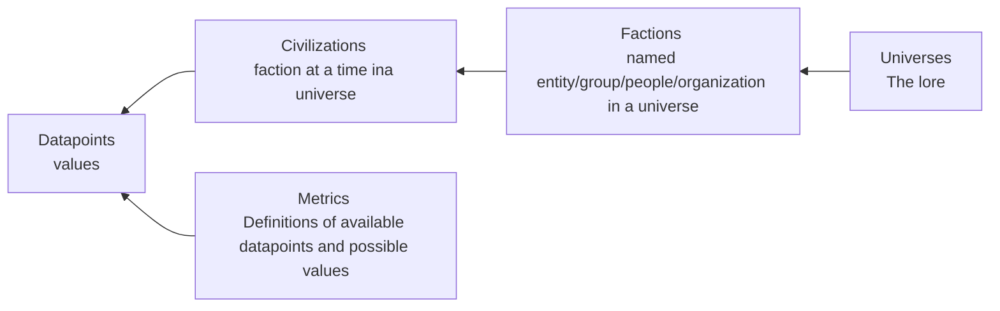

---
paths:
  - "src/**/*"
  - "*.csproj"
  - "*.sln"
  - "Dockerfile"
---

# Web Development

## Build & Run Commands

```bash
# Build solution
dotnet build futr.sln

# Run web application (from repo root)
dotnet run --project src/futr/futr.csproj

# Run all tests
dotnet test futr.sln

# Run specific test project
dotnet test src/futr.Test/futr.Test.csproj
dotnet test src/JsonPath.Test/JsonPath.Test.csproj

# Docker build & run
docker build -t futr .
docker run -p 80:80 futr
```

## Project Architecture

**ASP.NET Razor Pages web application** (.NET 8) serving civilization statistics from YAML files.

### Solution Structure
- `src/futr/` - Main web application (Razor Pages)
- `src/futr.Test/` - Integration tests (MSTest)
- `src/JsonPath/` - Custom YAML/JSON parsing library
- `src/ConfigSharp/` - Configuration library
- `src/n3q.Tools/` - Utility library

### Data Loading Flow
`FutrData.cs` orchestrates loading from the `data/` folder:
1. Load metric definitions from `data/metrics/*/info.yaml`
2. Load universes from `data/universes/*/info.yaml`
3. For each universe, load civilizations (non-`_` prefixed subfolders)
4. For each civilization, load datapoints (metric values)
5. Load factions from `_factions/` subfolder
6. Validate all referenced metrics exist

### Model Hierarchy
```
BaseModel (common fields: Id, Title, Tags, Order, Tile, Readme, Images, Links, References)
├── Metric (Type, Unit, Range)
├── Universe (Civilizations dict, Factions dict, ShowcaseMetrics)
├── Civilization (Universe ref, Faction ref, Date/Year, Datapoints dict)
├── Faction (Universe ref)
└── Datapoint (Civilization ref, Metric, Value, Min, Max, Confidence enum)
```

### Key Conventions
- Folder names become entity IDs and URL slugs (use spaces, not underscores)
- `_` prefix folders are special (e.g., `_factions/`)
- File lookup is case-insensitive
- `readme.md` content merged into entity's Readme field
- Images should use HTTPS URLs
- The `order` field controls display sorting (lower values appear first)

### Entity Relationships
