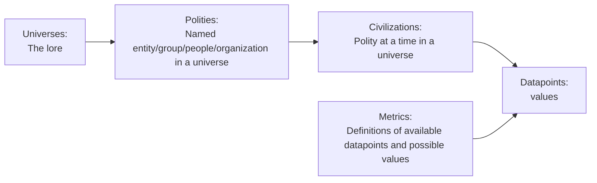
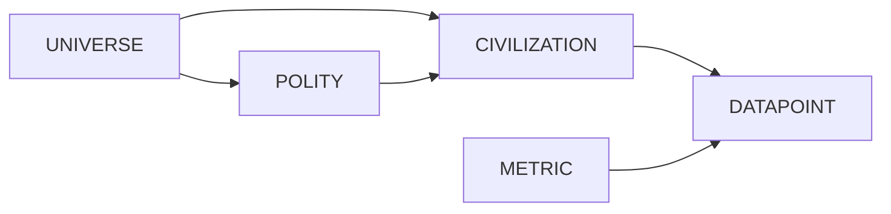

# CLAUDE.md

This file provides guidance to Claude Code (claude.ai/code) when working with code in this repository.

## Overview

FUTR (Fictional Universe Taxonomy Research) collects and analyzes statistical data about civilizations from fictional universes (Star Trek, Orion's Arm, etc.) and real-world history. Website: https://www.futr.space/

## Commits

- Do NOT add "Co-Authored-By: Claude" to commit messages
- Keep commit messages short: max 2 lines

## Tools

Do not ask for these commands in this folder: ls, grep, find, tree

## Purpose-Specific Guidelines

Additional context is loaded automatically based on what you're working on:

- **Web development** (`src/`, `*.csproj`, `*.css`, `*.js`, `*.cs`, `*.cshtml`, `Dockerfile`): See `.claude/rules/development.md`
- **Content/research** (`data/`, `images`, `readme`, `info`, `yaml`): See `.claude/rules/content.md`

## Project Information

## Conceptual Model

**Universes** contain **polities** (named peoples, planets, or empires). Polities can range from galaxy-spanning civilizations to a single individual. It depends on the universe, your interests, and available data.

A **civilization** is a polity at a specific point in time. Since polities change over time, we capture snapshots as civilizations (e.g., "Federation 2373" is the Federation of Planets in the year 2373).

**Metrics** describe civilizations with measurable data.

**Example:** Star Trek (universe) → Federation of Planets (polity) → Federation 2373 (civilization) → 150 member worlds (datapoint using metric: Planets)

### Entity Relationships

### Current Display Concept

To make things easier and better understandable, the Polity is shown as a second class citizen and Civilizations hang directly under Universe.

